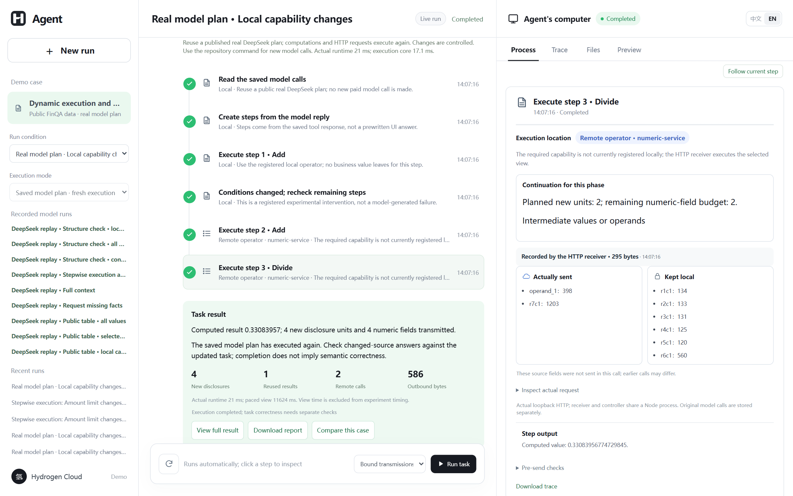
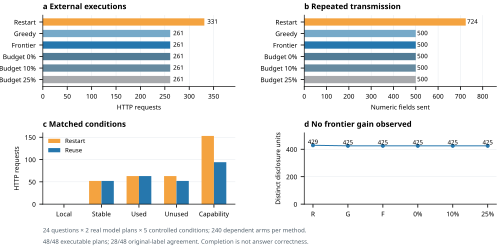
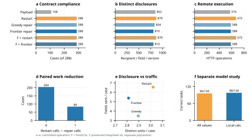
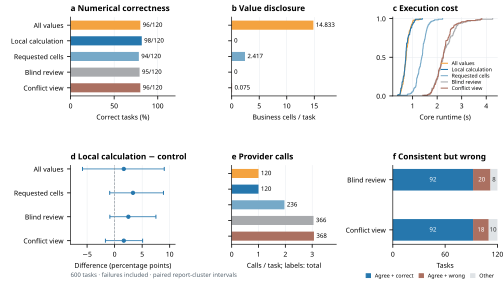

<a id="readme-top"></a>

<div align="center">
  <p>
    <a href="https://github.com/Zane-0260907/stepwise-disclosure-demo/actions/workflows/checks.yml"></a>
    <a href="LICENSE"></a>
    <a href="package.json"></a>
  </p>
  
  <h1>Stepwise Disclosure Demo</h1>
  <p>Decide where an agent step runs and what its current recipient receives.</p>
  <p>
    <a href="#getting-started"><strong>Get started »</strong></a><br>
    <a href="#usage">View walkthrough</a> ·
    <a href="#reproduce-the-experiment">Reproduce results</a> ·
    <a href="https://github.com/Zane-0260907/stepwise-disclosure-demo/issues">Report an issue</a> ·
    <a href="README.zh-CN.md">简体中文</a>
  </p>
</div>

<details>
  <summary><strong>Table of contents</strong></summary>

  - [About the project](#about-the-project)
    - [Built with](#built-with)
  - [Getting started](#getting-started)
  - [Usage](#usage)
  - [Reproduce the experiment](#reproduce-the-experiment)
  - [Evidence and limitations](#evidence-and-limitations)
  - [Repository map](#repository-map)
  - [Contributing](#contributing)
  - [License and citation](#license-and-citation)
</details>

## About the project

An agent can discover a new step only after reading local material or receiving a tool result. That step may need a different executor and a different set of facts. This prototype makes both decisions at each registered step: use a local rule when it can complete the operation; otherwise construct a view for the actual external recipient, check the final request before transmission, and record what the recipient received.

<p align="center">
  
</p>
<p align="center"><em>A saved real DeepSeek plan drives fresh HTTP execution. Select a step to inspect its view, remaining budget and actual receiver record.</em></p>

This is an independent research demo with synthetic contracts, study records and a restricted public FinQA table subset, not the commercial client. Its offline executor uses finite rules; the saved DeepSeek runs are real provider calls presented as replay. The interface labels those modes separately. The new table route lets a model propose a bounded calculation over a schema, then reads the numerical dependencies locally.

### Built with

<p>
  <a href="https://nodejs.org/"></a>
  <a href="https://developer.mozilla.org/docs/Web/JavaScript"></a>
  <a href="https://mozilla.github.io/pdf.js/"></a>
  <a href="https://playwright.dev/"></a>
  <a href="https://matplotlib.org/"></a>
</p>

Node.js runs the step planner, receiver and web interface; PDF.js reads the synthetic PDFs. Playwright verifies the interface, while Python/Matplotlib draws figures from saved experiment records. The current live-model adapter and prospective studies use DeepSeek. The original Qwen-Plus batch remains archived unchanged.

<p align="right"><a href="#readme-top">Back to top ↑</a></p>

## Current version: real model graphs and bounded continuation

The original goal remains **where each step runs and what its recipient receives**. V8 connects real model tool calls, a calculation graph, source/capability changes, valid-result reuse and actual receiver records. A shared phase budget bounds repeated numeric-field transmissions relative to the same phase's greedy continuation.

**Start here:** choose **Real model plan · Local capability changes**, run **Bound transmissions · reuse valid results**, and compare with **Restart all after the change**. Without a key, a saved real model plan drives new computations and HTTP requests. Use the batch command with your own key for new model calls. [Detailed English walkthrough and reproduction](docs/reproduction-v8.md).

## Getting started

**Prerequisite:** [Node.js 24](https://nodejs.org/). The offline walkthrough and recorded replay need no model key.

```sh
git clone https://github.com/Zane-0260907/stepwise-disclosure-demo.git
cd stepwise-disclosure-demo
npm ci
npm start
```

Open **http://127.0.0.1:4793/** and keep the terminal running. The server binds to localhost. Automated reproduction checks run on Windows and Ubuntu; interactive browser acceptance is checked on Windows. Docker is supplied but has not been independently acceptance-tested.

For a new live DeepSeek call, set `DEEPSEEK_API_KEY` in your local environment and restart. The adapter uses `deepseek-flash` in non-thinking mode. Do not commit the key or expose a key-bearing instance publicly; this demo has no multi-user authentication.

### Choose a run mode

| Mode | Key | What actually executes |
|:--|:--:|:--|
| Local rule executor | None | Parses synthetic input, applies finite rules and saves fresh records |
| Recorded DeepSeek run | None | Replays a preserved provider call and its original requests/results |
| DeepSeek live run | Your own | Makes new provider calls and records the resulting steps |
| Batch verification | None | Recomputes scores from the published archives |

Start with **Real model plan · Local capability changes** for a new HTTP execution, or **Request missing facts** in the recorded-run list for a saved model trace. The timeline advances automatically. Click any step to inspect its actual recipient and input; **Follow current step** resumes following. **Files** and **Preview** show the source or report. After completion, download the report or raw trace. Slower playback is shown separately from measured execution time.

### Configure live calls locally

Windows PowerShell, from the repository root:

```powershell
./scripts/start-demo.ps1 -UseDeepSeek
```

The script requests the key without displaying it. Stop the existing server terminal before restarting. Credentials are kept in the local process environment, not in the source, browser bundle or public trace.

Bash:

```bash
read -rsp 'DeepSeek API key: ' DEEPSEEK_API_KEY; echo
export DEEPSEEK_API_KEY
npm start
# After stopping the server:
unset DEEPSEEK_API_KEY
```

Select **DeepSeek · bring your key** in the interface. If port 4793 is occupied, set `DEMO_PORT=4794` before starting and open that port. More fixes appear in the [troubleshooting guide](docs/reproduction-v4.md#7-troubleshooting).

<p align="right"><a href="#readme-top">Back to top ↑</a></p>

## Usage

Select **Local rule executor** for a fresh run, then compare these synthetic cases:

| Case | What to inspect |
| :-- | :-- |
| Standard clause | The PDF is parsed and a supported step completes locally, without a model analysis request. |
| Reference clause | A new lookup appears during execution. Its checked view reaches a separate local HTTP receiver; the returned versioned reference is used by the next step. |
| Revoke before send | Revoking at the pause point blocks the pending request. Allowing the same step on another run produces a receiver record to compare. |

Click a step in the middle pane to inspect its selected recipient, facts sent, facts retained locally, request digest and result. The offline executor parses the PDF and writes a fresh run record each time, but its finite rules do not demonstrate language-model understanding. The **DeepSeek replay** entries reproduce preserved real calls without a key or a new provider request. Start with **Request missing facts** to see an initially insufficient view, a model-originated fact request, local authorization, and a second analysis. See the [step-by-step walkthrough](docs/demo-walkthrough.md). Slower UI playback is not experiment runtime.

<p align="right"><a href="#readme-top">Back to top ↑</a></p>

## Reproduce the experiment

### V8: real model plans and a complete execution chain

**24 public questions · 48 model plans · 96 actual calls · 1,440 paired executions.** Each plan is shared across five conditions and six controllers; these are not 1,440 independent model conversations.

| Measurement | Restart | Greedy repair | Frontier | Budget 0% |
|:--|--:|--:|--:|--:|
| Actual HTTP operator calls | 331 | 261 | 261 | 261 |
| Numeric fields transmitted | 724 | 500 | 500 | 500 |
| Distinct disclosure units | 429 | 425 | 425 | 425 |
| Program-consistent / 240 | 240 | 240 | 240 | 240 |
| Reference-expression agreement / 240 | 137 | 137 | 137 | 137 |

Original-label agreement is **28/48**, not human-adjudicated correctness; two average-question reference programs are suspect and remain unchanged. Reuse reduces calls 21.1%; **frontier and budget variants show no incremental benefit on this batch**. All disagreements and null results are public.

<p align="center"></p>

```sh
unzip -o evidence/validation-v8/reproduction-records.zip -d .
npm run verify:v8
```

The [complete guide](docs/reproduction-v8.md) covers the first walkthrough, offline checks, new paid calls, budgets, failures and metric limits. Earlier studies below remain separate; their observations are not pooled with V8.

### V7: dynamic repair, with an actual external check component

**288 controlled cases · 6 methods · 1,728 executions · 3,684 HTTP receipts.** FreshCtx 0.16.0 supplies 576 real action-boundary checks; our wrapper supplies the recovery policy.

| Method | Contract-compliant / 288 | Distinct disclosures | HTTP executions | Fields transmitted |
|:--|--:|--:|--:|--:|
| Payload-only ablation | 108 | 852 | 576 | 966 |
| Complete restart | 288 | 870 | 672 | 1,884 |
| Greedy repair | 288 | 834 | 588 | 1,002 |
| Frontier repair | 288 | 810 | 588 | 1,548 |
| FreshCtx + restart | 288 | 870 | 672 | 1,884 |
| FreshCtx + frontier repair | 288 | 810 | 588 | 1,548 |

**288 compliant = 264 completed + 24 correctly blocked.** Repair reduces remote work 12.5% versus restart. Frontier selection reduces distinct disclosures 2.9% versus greedy, but increases transmitted fields 54.5%. These are controlled parameter variants, not independent real-world tasks; disclosure counts are not a semantic privacy guarantee.

<p align="center"></p>

```sh
python -m zipfile -e evidence/validation-v7/reproduction-records.zip .
npm run verify:v7
```

No key or FreshCtx installation is needed to verify saved records. To run new experiments, follow the [complete v7 guide](docs/reproduction-v7.md) for a hash-pinned FreshCtx environment, commands, expected totals, per-case records, methods and troubleshooting.

### V6: separately preserved real DeepSeek utility study

**Separate v6 evidence: 600 tasks · 1,210 real DeepSeek requests · 60 public pages from 57 company-year reports.** The protocol was frozen before test calls. Every failure remains in the denominator.

| Method | Correct / planned | Business values sent per task | Calls |
|:--|--:|--:|--:|
| All values, one plan | 96/120 | 14.833 | 120 |
| Schema plan, local calculation | 98/120 | 0 | 120 |
| Requested cells | 94/120 | 2.417 | 236 |
| Three proposals + value-free review | 95/120 | 0 | 366 |
| Three proposals + conflict view | 96/120 | 0.075 | 368 |

Single-pass local calculation sends no business cell values. It still exposes the question, schema, years and units. Its accuracy difference against full values is **+1.67 points, descriptive interval −5.83 to +9.02**; this does not establish superiority or non-inferiority. Conflict review adds calls without an established utility gain, so it remains experimental.

<p align="center"></p>

### Verify without a model key

Run from the repository root. Python is needed only for standard-library archive extraction; use `python3` where appropriate.

```sh
npm test
python -m zipfile -e evidence/validation-v6/reproduction-records.zip .
npm run verify:v6
node scripts/verify-corrected-showcase.mjs
```

Expected totals: **600 tasks / 1,210 provider requests / 1,310 verified programs**. The script reconstructs table roles from the original cells, checks frozen hashes, re-executes programs, recomputes scores and matches every request/response to a distinct provider record. It makes no model calls. Three additional development showcase runs (five calls) are verified separately.

### Run a new experiment

After securely setting your own `DEEPSEEK_API_KEY` as described above:

```sh
npm run experiment:v6 -- --run-id=my-v6-01
node scripts/verify-v6.mjs --run-id=my-v6-01
```

A named run resumes missing jobs only. New results stay under ignored `data/research/validation/<run-id>/`; completed failures are not retried and published evidence is not overwritten. New provider outputs may differ from the preserved records.

### Redraw the figure

```sh
pip install -r requirements-plots.txt
python scripts/plot-v6.py --lang en
python scripts/plot-v6.py --lang zh
```

The [step-by-step reproduction guide](docs/reproduction-v6.md) covers installation, the walkthrough, credentials, sampling, all methods, uncertainty, failures and troubleshooting. [Frozen protocol, results and archives](evidence/validation-v6/) are public. The [bounded conflict-view mechanism](docs/conflict-view.md) explains what its minimum-cover guarantee does and does not mean.

<details>
<summary><strong>Earlier experiments and the table-adapter correction</strong></summary>

- **v4:** 256 synthetic-control tasks and 240 earlier table tasks. [Records](evidence/validation-v4/) · [Reproduction](docs/reproduction-v4.md).
- **v5:** 600 table tasks / 1,579 real calls. Candidate agreement did not resolve the observed utility loss. [Records](evidence/validation-v5/).
- **Correction:** v4/v5 sometimes hid year headers as business values, removing column meanings. Their numeric comparisons must be interpreted with this limitation. V6 uses the same repaired structure for all methods and excludes prior company-year reports. The repair is not claimed as an algorithmic invention. [Full correction](docs/table-adapter-correction.md).
- **v1–v3:** original [900-task archive](evidence/research/), [432-task study](evidence/validation-v2/), and [448-task study](evidence/validation-v3/) remain unchanged.

Historical results are not pooled into one success rate. A difference between batches is not a causal estimate of the adapter repair.

```sh
python -m zipfile -e evidence/validation-v5/reproduction-records.zip .
npm run verify:v5
```

</details>

<p align="right"><a href="#readme-top">Back to top ↑</a></p>

## Evidence and limitations

The [latest Chinese manuscript](paper/zh-CN/按步执行与信息共享_中文最新稿.pdf), [editable Word file](paper/zh-CN/按步执行与信息共享_中文最新稿.docx), and [equation/pseudocode source](paper/zh-CN/公式与算法源码.md) use the v8 prospective model-graph study, with v7/v6 retained separately. This is an editorial draft, not an accepted publication or a finished English ACM submission. See the [claim-to-evidence map](docs/claims-and-evidence.md).

The [progressive showcase](evidence/progressive-showcase/) is one additional real run, excluded from batch totals. It preserves the model's request for a needed late-day count **and an unnecessary contract amount**, followed by the CNY 1,150 result. The [earlier reference-lookup pair](evidence/research/deepseek-live-20260926/) is also retained separately. Neither is a substitute for batch evaluation.

- Success is checked against author-defined structured labels, not expert assessment of free-text advice. A 24-output blinded author-review packet is prepared; **human ratings are pending**.
- V7 runs the actual FreshCtx 0.16.0 check component with matched dependencies and our documented recovery wrappers. No end-to-end comparison against other complete agent systems has been run. [Research positioning and closest work](docs/research-position.md) states the overlap with MINIM, ToolMinimize, PlanTwin and prior minimization work. Local abstraction, active acquisition and calculation pushdown are not claimed as first inventions.
- The trusted local controller binds the used source values, recipient, current policy and exact application request. The separate local receiver and adapter record actual bytes; they are not cloud-provider certification.
- Field counts do not detect inferred sensitive information. Allowlisted facts can still be unnecessary. Arbitrary network bypasses and a compromised local controller are outside the model.
- Revocation blocks a future dispatch; it cannot retract a previous disclosure. Playback delays are never counted as model execution time.

<p align="right"><a href="#readme-top">Back to top ↑</a></p>

## Repository map

| Path | Contents |
| :-- | :-- |
| [`src/research/`](src/research/) | Planner, views, policy checks, receiver, model adapter and evaluator |
| [`web/`](web/) | Bilingual research interface, separate from the commercial product |
| [`fixtures/research/`](fixtures/research/) | Synthetic PDFs, task catalog, references and withheld labels |
| [`evidence/validation-v7/`](evidence/validation-v7/) | Preserved controlled-repair protocol, all records, event strata and bilingual figures |
| [`evidence/validation-v6/`](evidence/validation-v6/) | Separately preserved real model calls and utility evaluation |
| [`fixtures/finqa-v6/`](fixtures/finqa-v6/) | Public subset, separate labels, pinned provenance and original license |
| [`paper/zh-CN/`](paper/zh-CN/) | Latest Chinese manuscript and native Word formula source |
| [`evidence/research/`](evidence/research/) | Unchanged original study and earlier live-call records |
| [`evidence/progressive-showcase/`](evidence/progressive-showcase/) | Earlier preserved trace and bilingual browser screenshots |
| [`scripts/`](scripts/) | Input checks, independent score verification, summaries and plots |

<p align="right"><a href="#readme-top">Back to top ↑</a></p>

## Contributing

Bug reports and reproducibility questions are welcome through [GitHub Issues](https://github.com/Zane-0260907/stepwise-disclosure-demo/issues). Read [CONTRIBUTING.md](CONTRIBUTING.md) before changing the implementation. Frozen runs must remain reproducible; changes to their inputs or evaluator belong in a new protocol version.

<p align="right"><a href="#readme-top">Back to top ↑</a></p>

## License and citation

Software is released under [Apache-2.0](LICENSE). The FinQA subset retains its [MIT notice](fixtures/finqa-v6/LICENSE.FinQA). The included mark and product name identify this research demo; the software license does not grant trademark rights. See [ASSETS.md](ASSETS.md) for provenance and [CITATION.cff](CITATION.cff) for the software citation. A paper citation can be added when the manuscript has a stable publication record.

<p align="right"><a href="#readme-top">Back to top ↑</a></p>
