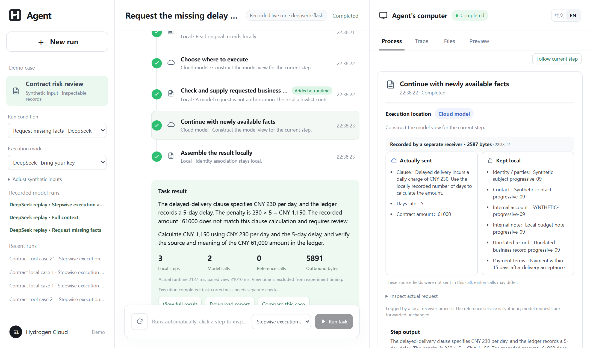
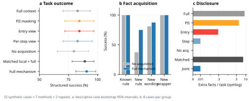

<a id="readme-top"></a>

<div align="center">
  <p>
    <a href="https://github.com/Zane-0260907/stepwise-disclosure-demo/actions/workflows/checks.yml"></a>
    <a href="LICENSE"></a>
    <a href="package.json"></a>
  </p>
  
  <h1>Stepwise Disclosure Demo</h1>
  <p>Decide where an agent step runs and what its current recipient receives.</p>
  <p>
    <a href="#getting-started"><strong>Get started »</strong></a><br>
    <a href="#usage">View walkthrough</a> ·
    <a href="#reproduce-the-experiment">Reproduce results</a> ·
    <a href="https://github.com/Zane-0260907/stepwise-disclosure-demo/issues">Report an issue</a> ·
    <a href="README.zh-CN.md">简体中文</a>
  </p>
</div>

<details>
  <summary><strong>Table of contents</strong></summary>

  - [About the project](#about-the-project)
    - [Built with](#built-with)
  - [Getting started](#getting-started)
  - [Usage](#usage)
  - [Reproduce the experiment](#reproduce-the-experiment)
  - [Evidence and limitations](#evidence-and-limitations)
  - [Repository map](#repository-map)
  - [Contributing](#contributing)
  - [License and citation](#license-and-citation)
</details>

## About the project

An agent can discover a new step only after reading local material or receiving a tool result. That step may need a different executor and a different set of facts. This prototype makes both decisions at each registered step: use a local rule when it can complete the operation; otherwise construct a view for the actual external recipient, check the final request before transmission, and record what the recipient received.

<p align="center">
  
</p>
<p align="center"><em>Recorded DeepSeek run in the English interface. The right pane can also show the selected step's recipient view and receiver record.</em></p>

This is an independent research demo with synthetic contracts and study records, not the commercial client. Its offline executor uses finite rules; the saved DeepSeek runs are real provider calls presented as replay. The interface labels those modes separately.

### Built with

<p>
  <a href="https://nodejs.org/"></a>
  <a href="https://developer.mozilla.org/docs/Web/JavaScript"></a>
  <a href="https://mozilla.github.io/pdf.js/"></a>
  <a href="https://playwright.dev/"></a>
  <a href="https://matplotlib.org/"></a>
</p>

Node.js runs the step planner, receiver and web interface; PDF.js reads the synthetic PDFs. Playwright verifies the interface, while Python/Matplotlib draws figures from saved experiment records. The current live-model adapter and prospective studies use DeepSeek. The original Qwen-Plus batch remains archived unchanged.

<p align="right"><a href="#readme-top">Back to top ↑</a></p>

## Getting started

**Prerequisite:** [Node.js 24](https://nodejs.org/). The offline walkthrough and recorded replay need no model key.

```sh
git clone https://github.com/Zane-0260907/stepwise-disclosure-demo.git
cd stepwise-disclosure-demo
npm ci
npm start
```

Open **http://127.0.0.1:4793/**. The server binds to localhost by default. Windows is the verified runtime; Docker and Linux are provided as starting points but have not been acceptance-tested.

For a new live DeepSeek call, set `DEEPSEEK_API_KEY` in your local environment and restart. The adapter uses `deepseek-flash` in non-thinking mode. Do not commit the key or expose a key-bearing instance publicly; this demo has no multi-user authentication.

<p align="right"><a href="#readme-top">Back to top ↑</a></p>

## Usage

Select **Local rule executor** for a fresh run, then compare these synthetic cases:

| Case | What to inspect |
| :-- | :-- |
| Standard clause | The PDF is parsed and a supported step completes locally, without a model analysis request. |
| Reference clause | A new lookup appears during execution. Its checked view reaches a separate local HTTP receiver; the returned versioned reference is used by the next step. |
| Revoke before send | Revoking at the pause point blocks the pending request. Allowing the same step on another run produces a receiver record to compare. |

Click a step in the middle pane to inspect its selected recipient, facts sent, facts retained locally, request digest and result. The offline executor parses the PDF and writes a fresh run record each time, but its finite rules do not demonstrate language-model understanding. The **DeepSeek replay** entries reproduce preserved real calls without a key or a new provider request. Start with **Request missing facts** to see an initially insufficient view, a model-originated fact request, local authorization, and a second analysis. See the [step-by-step walkthrough](docs/demo-walkthrough.md). Slower UI playback is not experiment runtime.

<p align="right"><a href="#readme-top">Back to top ↑</a></p>

## Reproduce the experiment

The current study freezes **32 synthetic cases × 7 methods × 2 repeats = 448 tasks**, using `deepseek-flash`. Its 560 real provider calls have matching receiver and provider-egress records. All planned tasks, including failures, are retained. These are author-created inputs in two existing task domains, not an external benchmark.

| Method | Structured success | Extra facts/task | Model calls |
| :-- | --: | --: | --: |
| Full context | 53/64 · 82.8% | 8.625 | 80 |
| PII masking | 54/64 · 84.4% | 4.125 | 80 |
| Entry view | 54/64 · 84.4% | 0.281 | 96 |
| Per-step view, fixed executor | 53/64 · 82.8% | 0.031 | 96 |
| No fact acquisition | 51/64 · 79.7% | 0 | 64 |
| Same local rules + full context | 57/64 · 89.1% | 7.188 | 64 |
| Full mechanism | **58/64 · 90.6%** | **0.031** | 80 |

<p align="center"></p>

Fact acquisition adds **10.94 percentage points** over its disabled control (paired, descriptive case-bootstrap 95% interval: **1.56 to 23.44**), at the cost of 16 additional model calls. Against the control with the same local rules and full context, the success difference is **1.56 points**, with an interval of **−10.94 to 14.06**. This does **not** establish superior or equivalent task quality. Two unnecessary field transmissions remain in the full mechanism; authorized does not mean necessary.

Re-score all 448 saved tasks **without a key or new model calls**:

```sh
npm test
node scripts/verify-progressive-showcase.mjs
python -m zipfile -e evidence/validation-v3/reproduction-records.zip .
npm run verify:v3
```

The archive extracts to ignored `data/research/validation/`. The [v3 protocol](evidence/validation-v3/protocol.json) freezes code, fixtures, labels and comparison definitions before the calls. [Results, failures and case aggregates](evidence/validation-v3/) are public. To redraw: `pip install -r requirements-plots.txt`, then `python scripts/plot-validation.py --lang en`.

<details>
<summary><strong>Development history and earlier evidence</strong></summary>

- **v1:** 60 cases, five methods, three repeats = 900 Qwen-Plus tasks. Original code and inputs remain frozen. [Results](evidence/research/results/) and [raw archive](evidence/research/reproduction-records.zip) remain available.
- **v2:** 36 new same-domain cases, six methods, two repeats = 432 DeepSeek tasks. This exposed omitted necessary inputs and was subsequently used for development. It is **not** a holdout for v3. [Protocol and results](evidence/validation-v2/).
- **v3:** The 448-task study above evaluates the revised mechanism on newly authored same-domain cases after a new freeze. Do not pool the three versions into one success rate.

```sh
python -m zipfile -e evidence/research/reproduction-records.zip .
node scripts/verify-recorded-scores.mjs frozen-v1-20260925
python -m zipfile -e evidence/validation-v2/reproduction-records.zip .
npm run verify:v2
npm run test:binding
```

The deterministic request-binding study blocks 52/52 altered requests versus 12/52 under the earlier checks; both allow all eight legitimate cases. This validates a bounded local control path, not semantic privacy against arbitrary attacks. [Saved results](evidence/request-binding/summary.json).

</details>

<p align="right"><a href="#readme-top">Back to top ↑</a></p>

## Evidence and limitations

The [progressive showcase](evidence/progressive-showcase/) is one additional real run, excluded from batch totals. It preserves the model's request for a needed late-day count **and an unnecessary contract amount**, followed by the CNY 1,150 result. The [earlier reference-lookup pair](evidence/research/deepseek-live-20260926/) is also retained separately. Neither is a substitute for batch evaluation.

- Success is checked against author-defined structured labels, not expert assessment of free-text advice. A 24-output blinded author-review packet is prepared; **human ratings are pending**.
- All seven methods are implemented here as mechanism controls. No external-system baseline has been run. [Research positioning and closest work](docs/research-position.md) states the overlap with MINIM, ToolMinimize, PlanTwin and SplitAgent.
- The trusted local controller binds the used source values, recipient, current policy and exact application request. The separate local receiver and adapter record actual bytes; they are not cloud-provider certification.
- Field counts do not detect inferred sensitive information. Allowlisted facts can still be unnecessary. Arbitrary network bypasses and a compromised local controller are outside the model.
- Revocation blocks a future dispatch; it cannot retract a previous disclosure. Playback delays are never counted as model execution time.

<p align="right"><a href="#readme-top">Back to top ↑</a></p>

## Repository map

| Path | Contents |
| :-- | :-- |
| [`src/research/`](src/research/) | Planner, views, policy checks, receiver, model adapter and evaluator |
| [`web/`](web/) | Bilingual research interface, separate from the commercial product |
| [`fixtures/research/`](fixtures/research/) | Synthetic PDFs, task catalog, references and withheld labels |
| [`evidence/validation-v3/`](evidence/validation-v3/) | Current frozen protocol, full run archive, scores, failures and figures |
| [`evidence/research/`](evidence/research/) | Unchanged original study and earlier live-call records |
| [`evidence/progressive-showcase/`](evidence/progressive-showcase/) | Current preserved trace and bilingual browser screenshots |
| [`scripts/`](scripts/) | Input checks, independent score verification, summaries and plots |

<p align="right"><a href="#readme-top">Back to top ↑</a></p>

## Contributing

Bug reports and reproducibility questions are welcome through [GitHub Issues](https://github.com/Zane-0260907/stepwise-disclosure-demo/issues). Read [CONTRIBUTING.md](CONTRIBUTING.md) before changing the implementation. Frozen runs must remain reproducible; changes to their inputs or evaluator belong in a new protocol version.

<p align="right"><a href="#readme-top">Back to top ↑</a></p>

## License and citation

Software is released under [Apache-2.0](LICENSE). The included mark and product name identify this research demo; the software license does not grant trademark rights. See [ASSETS.md](ASSETS.md) for provenance and [CITATION.cff](CITATION.cff) for the software citation. A paper citation can be added when the manuscript has a stable publication record.

<p align="right"><a href="#readme-top">Back to top ↑</a></p>
