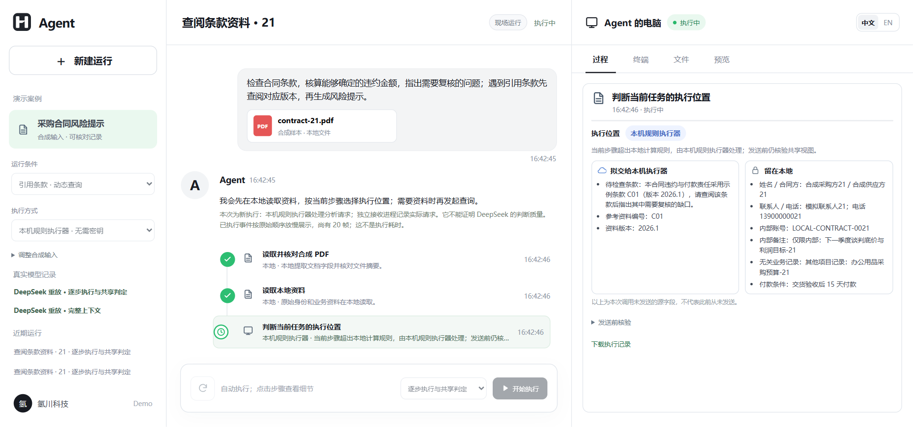
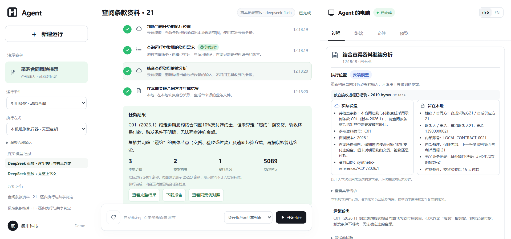
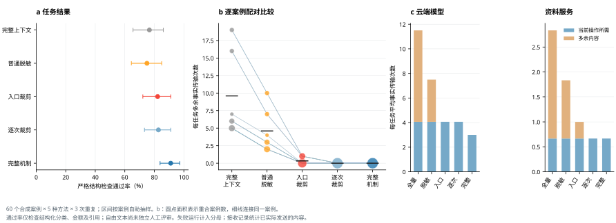

# Stepwise Disclosure Demo

**A runnable research prototype for deciding where an agent step runs and which facts cross the boundary.**

**English** · [简体中文](README.zh-CN.md) · [Evidence and limitations](#what-the-evidence-supports) · [Reproduce the experiment](#reproduce-the-frozen-experiment)

*A live offline run. Select a step to inspect the proposed transfer, retained facts, recipient record, and result. The interface can be switched to English; original source documents and actual request payloads retain their source language for audit.*

## Research question

An agent may discover a new step only after reading local material or receiving a tool result. At that point, an earlier decision about *where to execute* and *what to disclose* may no longer fit. This prototype makes the two decisions together for each step: choose a registered local or external executor, build a recipient-specific view, check authorization immediately before transmission, and re-evaluate when a later step appears.

This is an **independent, bounded research demo** using synthetic contracts and study records. It is not the commercial client, a general-purpose data-loss prevention system, or an unrestricted agent framework.

## Try it without a key

Install [Node.js 24](https://nodejs.org/) and run:

~~~sh
npm ci
npm start
~~~

Open **http://127.0.0.1:4793/**. The server binds to localhost by default.

1. Leave **Local rule executor** selected. Run the *standard clause* case to see a step completed locally without an analysis request.
2. Run the *reference clause* case. The executor reads a synthetic PDF, discovers a reference lookup, sends a checked view to an independent local HTTP receiver, then resumes with the returned versioned reference.
3. Run the *revoke before send* case. Revoke at the pause point; the pre-send check blocks transmission. Allow it on another run to compare the receiver record.

The offline executor really parses the supplied synthetic PDF, checks each transfer and writes a fresh run record. It uses finite rules rather than a language model. The **two DeepSeek entries** in the sidebar replay preserved real calls for the same synthetic contract, with no key or new provider request. The UI labels fresh execution and recorded replay separately; the animation time is **not** experimental execution time.

To make a new live DeepSeek call, supply your own `DEEPSEEK_API_KEY` in your local environment and restart. The key is never required for the offline walkthrough or saved replay. Do not commit credentials or expose a key-bearing instance to the public internet; this demo has no multi-user authentication. The live adapter uses `deepseek-flash`, non-thinking mode.

*Saved DeepSeek run: the right pane separates facts sent to the recipient from facts retained locally.*

## Reproduce the frozen experiment

The primary batch is **60 synthetic cases × 5 methods × 3 repetitions = 900 task runs**, frozen as `frozen-v1-20260925` with model `qwen-plus`. One task may contain multiple model calls. The five methods are full context, ordinary PII masking, entry-only projection, per-step projection with fixed executor, and joint stepwise decision. The first four are baselines implemented in **this** codebase, not reimplementations of external systems.

The primary endpoint is **strict structured-task success**, checked against withheld ground truth. It is not a human judgment of prose quality. Repetitions are aggregated within each case before paired comparisons.

| Method | Structured success | Mean unnecessary facts sent per task |
| :-- | --: | --: |
| Full context | 76.7% | 9.6 |
| PII masking | 75.0% | 4.6 |
| Entry projection | 82.2% | 0.33 |
| Per-step projection | 82.8% | 0 |
| Joint stepwise decision | **91.1%** | **0** |

Values come from [`summary.json`](evidence/research/results/summary.json); intervals, paired differences, failures and per-case results are retained alongside it. The differences are observations under the fixed synthetic protocol, not claims of broad deployment performance.

Recheck inputs, executable controls and saved DeepSeek records:

~~~sh
npm run check:inputs
npm test
npm run test:boundaries
node scripts/verify-deepseek-records.mjs
~~~

Recompute the **900 saved runs** without a model key or another model call:

~~~sh
python -m zipfile -e evidence/research/reproduction-records.zip .
node scripts/verify-recorded-scores.mjs frozen-v1-20260925
node scripts/summarize-research.mjs frozen-v1-20260925
~~~

The extraction creates ignored `data/research/experiments/` files. To regenerate plots, install Python 3.11+, then `python -m pip install -r requirements-plots.txt` and `npm run plot`. CJK fonts such as Noto Sans CJK may be needed on Linux for Chinese labels. Windows is the verified runtime; Docker and Linux are provided as starting points but were not acceptance-tested.

The frozen protocol and source hashes are in [`frozen-protocol.json`](evidence/research/frozen-protocol.json). Editing the core, fixtures, evaluator or lockfile invalidates the frozen protocol rather than silently producing “the same” experiment.

## Two preserved DeepSeek runs

For one synthetic contract, the [saved live-call bundle](evidence/research/deepseek-live-20260926/) contains a joint run and a full-context comparison. **Each** made two DeepSeek model calls and one synthetic-reference lookup. The joint run sent **5,089 bytes** across its recorded requests; the full-context run sent **6,273 bytes**. These are a **single-case illustration**, not 900 DeepSeek trials, a significance result, or a cross-model quality comparison. The raw provider request bodies, digests, receiver records, event frames, generated results and English presentation translations are kept separately. No API key is part of the bundle.

## What the evidence supports

- The offline walkthrough demonstrates the step and transfer control path, not language-model understanding.
- The batch tests structured outcomes on controlled synthetic cases. The development and evaluation sets share task families; unseen-template generalization and real-enterprise deployment are untested.
- The receiver observes real HTTP requests in a separate local process. Its records and the provider-egress adapter trace support application-level audit, not an independent certification by the cloud provider or protection against arbitrary bypass traffic.
- A changed authorization can block a **future** send. It cannot retrieve facts already transmitted.
- End-to-end wall time, kernel time and UI playback time have different scopes. Read [the original measurement notes](README.zh-CN.md#证据边界) before quoting latency numbers.

## Repository map

| Path | Purpose |
| :-- | :-- |
| [`src/research/`](src/research/) | Step planner, view construction, policy check, receiver, model adapter and evaluator |
| [`web/`](web/) | Minimal bilingual research interface, separate from the commercial product |
| [`fixtures/research/`](fixtures/research/) | Synthetic PDFs, task catalog, references and withheld evaluation labels |
| [`evidence/research/`](evidence/research/) | Frozen protocol, raw-run archive, scores, boundary tests, real-call records and screenshots |
| [`scripts/`](scripts/) | Input checks, independent score verification, summaries and plots |

See [CONTRIBUTING.md](CONTRIBUTING.md) for changes and [ASSETS.md](ASSETS.md) for asset provenance. The source is released under [Apache-2.0](LICENSE). The logo and product name are included for identification of this research demo; the software license does not grant trademark rights. The author-provided software citation is in [CITATION.cff](CITATION.cff). A paper citation can be added when the manuscript has a stable publication record.
