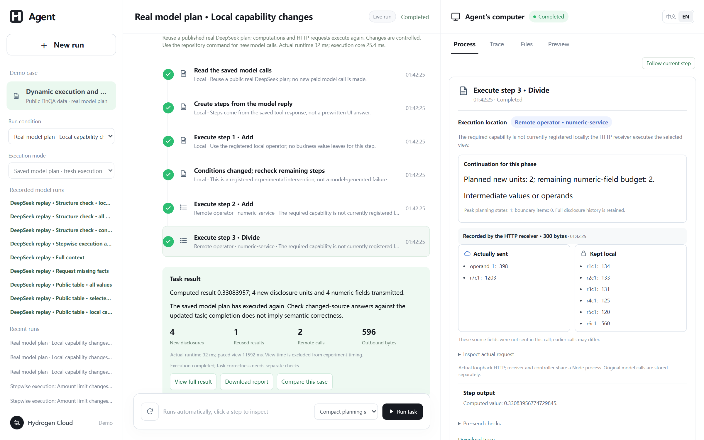

<a id="readme-top"></a>

<div align="center">
  <p>
    <a href="https://github.com/Zane-0260907/stepwise-disclosure-demo/actions/workflows/checks.yml"></a>
    <a href="LICENSE"></a>
    <a href="package.json"></a>
  </p>
  
  <h1>Stepwise Disclosure Demo</h1>
  <p>Decide where an agent step runs and what its current recipient receives.</p>
  <p>
    <a href="#getting-started"><strong>Get started »</strong></a><br>
    <a href="#usage">View walkthrough</a> ·
    <a href="#reproduce-the-experiment">Reproduce results</a> ·
    <a href="https://github.com/Zane-0260907/stepwise-disclosure-demo/issues">Report an issue</a> ·
    <a href="README.zh-CN.md">简体中文</a>
  </p>
</div>

<details>
  <summary><strong>Table of contents</strong></summary>

  - [About the project](#about-the-project)
    - [Built with](#built-with)
  - [Getting started](#getting-started)
  - [Usage](#usage)
  - [Reproduce the experiment](#reproduce-the-experiment)
  - [Evidence and limitations](#evidence-and-limitations)
  - [Repository map](#repository-map)
  - [Contributing](#contributing)
  - [License and citation](#license-and-citation)
</details>

## About the project

An agent can discover a new step only after reading local material or receiving a tool result. That step may need a different executor and a different set of facts. This prototype makes both decisions at each registered step: use a local rule when it can complete the operation; otherwise construct a view for the actual external recipient, check the final request before transmission, and record what the recipient received.

<p align="center">
  
</p>
<p align="center"><em>A saved real DeepSeek plan drives fresh HTTP execution. Select a step to inspect its view, remaining budget and actual receiver record.</em></p>

This is an independent research demo with synthetic contracts, study records and a restricted public FinQA table subset, not the commercial client. Its offline executor uses finite rules; the saved DeepSeek runs are real provider calls presented as replay. The interface labels those modes separately. The new table route lets a model propose a bounded calculation over a schema, then reads the numerical dependencies locally.

### Built with

<p>
  <a href="https://nodejs.org/"></a>
  <a href="https://developer.mozilla.org/docs/Web/JavaScript"></a>
  <a href="https://mozilla.github.io/pdf.js/"></a>
  <a href="https://playwright.dev/"></a>
  <a href="https://matplotlib.org/"></a>
</p>

Node.js runs the step planner, receiver and web interface; PDF.js reads the synthetic PDFs. Playwright verifies the interface, while Python/Matplotlib draws figures from saved experiment records. The current live-model adapter and prospective studies use DeepSeek. The original Qwen-Plus batch remains archived unchanged.

<p align="right"><a href="#readme-top">Back to top ↑</a></p>

## Current version: inspectable execution and exact planning

[Four-page Chinese Word draft](paper/zh-CN/按步执行与信息共享_中文最新稿.docx) · [PDF](paper/zh-CN/按步执行与信息共享_中文最新稿.pdf) · [Equations and pseudocode](paper/zh-CN/公式与算法源码.md) · [Complete reproduction guide](docs/reproduction-frontier.md)

The new planner retires suffix-irrelevant token identities from search state and combines disclosure-disjoint cost components under one transmission budget. Full recipient history persists; new steps and state changes trigger replanning. Alternatives must be registered and output-equivalent. [Assumptions and exactness proof](docs/live-frontier-proof.md).

| Evidence | Result | What it establishes |
| :-- | :-- | :-- |
| 48 constructed workloads, three budgets | 144/144 match independent MILP optima | Exactness on the finite-choice study |
| Key-mechanism ablation | 129/144 complete; 15 hit the state limit | A measurable role for compression and decomposition |
| Reexecution of real model plans | 480 completions, 522 HTTP receipts | Plans connect to actual dispatch |
| 0% / 25% / 100% extra field budget | 1.94% / 14.62% / 27.47% fewer distinct items | Benefits depend on budget; traffic can increase |

These are not 144 natural tasks or new model calls. Source model-label agreement remains 28/48; the planner does not correct model answers. [All results, failures and the timing correction](evidence/frontier-study/README.md) are public.

## Getting started

**Prerequisite:** [Node.js 24](https://nodejs.org/). The offline walkthrough and recorded replay need no model key.

```sh
git clone https://github.com/Zane-0260907/stepwise-disclosure-demo.git
cd stepwise-disclosure-demo
npm ci
npm start
```

Open **http://127.0.0.1:4793/** and keep the terminal running. The server binds to localhost. Automated reproduction checks run on Windows and Ubuntu; interactive browser acceptance is checked on Windows. Docker is supplied but has not been independently acceptance-tested.

For a new live DeepSeek call, set `DEEPSEEK_API_KEY` in your local environment and restart. The adapter uses `deepseek-flash` in non-thinking mode. Do not commit the key or expose a key-bearing instance publicly; this demo has no multi-user authentication.

### Choose a run mode

| Mode | Key | What actually executes |
|:--|:--:|:--|
| Local rule executor | None | Parses synthetic input, applies finite rules and saves fresh records |
| Recorded DeepSeek run | None | Replays a preserved provider call and its original requests/results |
| DeepSeek live run | Your own | Makes new provider calls and records the resulting steps |
| Batch verification | None | Recomputes scores from the published archives |

Start with **Real model plan · Local capability changes** for a new HTTP execution, or **Request missing facts** in the recorded-run list for a saved model trace. The timeline advances automatically. Click any step to inspect its actual recipient and input; **Follow current step** resumes following. **Files** and **Preview** show the source or report. After completion, download the report or raw trace. Slower playback is shown separately from measured execution time.

### Configure live calls locally

Windows PowerShell, from the repository root:

```powershell
./scripts/start-demo.ps1 -UseDeepSeek
```

The script requests the key without displaying it. Stop the existing server terminal before restarting. Credentials are kept in the local process environment, not in the source, browser bundle or public trace.

Bash:

```bash
read -rsp 'DeepSeek API key: ' DEEPSEEK_API_KEY; echo
export DEEPSEEK_API_KEY
npm start
# After stopping the server:
unset DEEPSEEK_API_KEY
```

Select **DeepSeek · bring your key** in the interface. If port 4793 is occupied, set `DEMO_PORT=4794` before starting and open that port. More fixes appear in the [troubleshooting guide](docs/reproduction-v4.md#7-troubleshooting).

<p align="right"><a href="#readme-top">Back to top ↑</a></p>

## Usage

1. Choose **Real model plan · Local capability changes**, keep the default compressed planner, and start.
2. The left pane advances automatically. Inspect placement, input, actual receiver body and budget on the right. A registered intervention withdraws local capability after the first calculation; the valid result is retained.
3. Inspect an earlier step, then use **Follow current step** to resume following. Files, preview and downloads preserve the source and trace.
4. Compare **Restart all after the change**. The genuine model plan is saved; this run performs fresh computation and HTTP requests without a key.

Presentation pacing is excluded from execution time. The short model plans have the same optimum under greedy and exact planning; the separate study measures differences on longer workloads. [Detailed walkthrough and troubleshooting](docs/reproduction-frontier.md).

## Reproduce the experiment

```sh
npm test
node scripts/verify-frontier-study.mjs
python scripts/analyze-frontier-study.py --check
python -m zipfile -e evidence/validation-v8/reproduction-records.zip .
node scripts/run-live-integration.mjs --check
```

Expect 4,380 recorded paths checked, 144 final settings solved again, and 480 actual reexecutions. Python checks use its standard library. No model API is called.

To run the independent optimizer or time your own machine, follow the [complete guide](docs/reproduction-frontier.md#3-run-the-independent-optimizer-again), install `requirements-frontier.txt`, and run `node scripts/run-disclosure-study.mjs --out=data/research/frontier-local`. New records go to a separate local directory; published evidence remains intact.

## Evidence and limitations

- Disclosure-item counts are not a semantic privacy guarantee. At 25% extra field budget, distinct items fall 14.62% while transmitted fields rise 18.90%.
- Exactness covers registered equivalent alternatives and the currently known suffix. Runtime history is retained; unknown future steps are not predicted.
- Original model errors, unsuccessful candidates and null results remain available. Separate studies are not pooled into one success rate.
- This is an independent research UI; the commercial client is excluded. The Chinese manuscript is an editorial draft. Author ORCIDs, deferred video and human ratings remain outstanding.

<details>
<summary><strong>Historical experiments and development records</strong></summary>

- [V8 real model plans](docs/reproduction-v8.md): 24 questions, 48 plans, 96 model calls; no additional planning benefit on those short tasks.
- [V7 dynamic repair](docs/reproduction-v7.md) · [V6 model study](docs/reproduction-v6.md).
- [Unsuccessful V9 candidate](evidence/development-v9/README.md) · [V10 native business development](evidence/development-v10/README.md) · [Mechanism attribution check](docs/mechanism-gate.zh-CN.md).
- [Earlier adapter correction](docs/table-adapter-correction.md) · [All stages of the current study](evidence/frontier-study/README.md).

Different batches are not independent samples of one study; development results are not held-out confirmation.

</details>

## Repository map

| Path | Contents |
| :-- | :-- |
| [`src/research/`](src/research/) | Planner, views, policy checks, receiver, model adapter and evaluator |
| [`web/`](web/) | Bilingual research interface, separate from the commercial product |
| [`fixtures/research/`](fixtures/research/) | Synthetic PDFs, task catalog, references and withheld labels |
| [`evidence/validation-v7/`](evidence/validation-v7/) | Preserved controlled-repair protocol, all records, event strata and bilingual figures |
| [`evidence/validation-v6/`](evidence/validation-v6/) | Separately preserved real model calls and utility evaluation |
| [`fixtures/finqa-v6/`](fixtures/finqa-v6/) | Public subset, separate labels, pinned provenance and original license |
| [`paper/zh-CN/`](paper/zh-CN/) | Latest Chinese manuscript and native Word formula source |
| [`evidence/research/`](evidence/research/) | Unchanged original study and earlier live-call records |
| [`evidence/progressive-showcase/`](evidence/progressive-showcase/) | Earlier preserved trace and bilingual browser screenshots |
| [`scripts/`](scripts/) | Input checks, independent score verification, summaries and plots |

<p align="right"><a href="#readme-top">Back to top ↑</a></p>

## Contributing

Bug reports and reproducibility questions are welcome through [GitHub Issues](https://github.com/Zane-0260907/stepwise-disclosure-demo/issues). Read [CONTRIBUTING.md](CONTRIBUTING.md) before changing the implementation. Frozen runs must remain reproducible; changes to their inputs or evaluator belong in a new protocol version.

<p align="right"><a href="#readme-top">Back to top ↑</a></p>

## License and citation

Software is released under [Apache-2.0](LICENSE). The FinQA subset retains its [MIT notice](fixtures/finqa-v6/LICENSE.FinQA). The included mark and product name identify this research demo; the software license does not grant trademark rights. See [ASSETS.md](ASSETS.md) for provenance and [CITATION.cff](CITATION.cff) for the software citation. A paper citation can be added when the manuscript has a stable publication record.

<p align="right"><a href="#readme-top">Back to top ↑</a></p>
