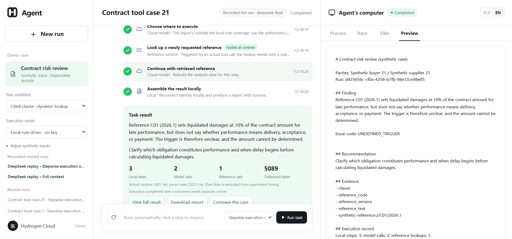
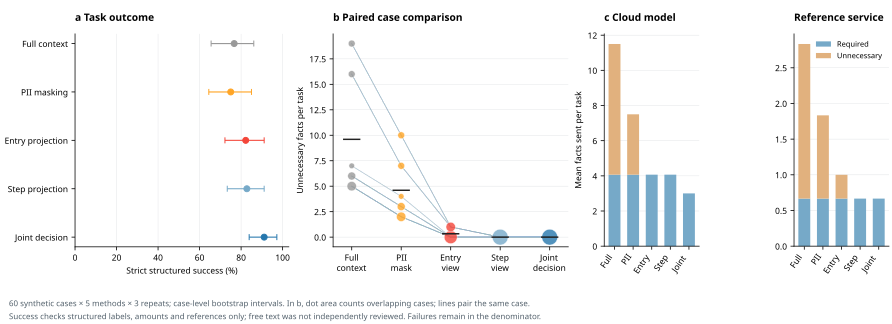

<a id="readme-top"></a>

<div align="center">
  
  <h1>Stepwise Disclosure Demo</h1>
  <p>Decide where an agent step runs and what its current recipient receives.</p>
  <p>
    <a href="#getting-started"><strong>Get started »</strong></a><br>
    <a href="#usage">View walkthrough</a> ·
    <a href="#reproduce-the-experiment">Reproduce results</a> ·
    <a href="https://github.com/Zane-0260907/stepwise-disclosure-demo/issues">Report an issue</a> ·
    <a href="README.zh-CN.md">简体中文</a>
  </p>
  <p>
    <a href="https://github.com/Zane-0260907/stepwise-disclosure-demo/actions/workflows/checks.yml"></a>
    <a href="LICENSE"></a>
    <a href="package.json"></a>
  </p>
</div>

<details>
  <summary><strong>Table of contents</strong></summary>

  - [About the project](#about-the-project)
    - [Built with](#built-with)
  - [Getting started](#getting-started)
  - [Usage](#usage)
  - [Reproduce the experiment](#reproduce-the-experiment)
  - [Evidence and limitations](#evidence-and-limitations)
  - [Repository map](#repository-map)
  - [Contributing](#contributing)
  - [License and citation](#license-and-citation)
</details>

## About the project

An agent can discover a new step only after reading local material or receiving a tool result. That step may need a different executor and a different set of facts. This prototype makes both decisions at each registered step: use a local rule when it can complete the operation; otherwise construct a view for the actual external recipient, check the final request before transmission, and record what the recipient received.

<p align="center">
  
</p>
<p align="center"><em>Recorded DeepSeek run in the English interface. The right pane can also show the selected step's recipient view and receiver record.</em></p>

This is an independent research demo with synthetic contracts and study records, not the commercial client. Its offline executor uses finite rules; the saved DeepSeek runs are real provider calls presented as replay. The interface labels those modes separately.

### Built with

<p>
  <a href="https://nodejs.org/"></a>
  <a href="https://developer.mozilla.org/docs/Web/JavaScript"></a>
  <a href="https://mozilla.github.io/pdf.js/"></a>
  <a href="https://playwright.dev/"></a>
  <a href="https://matplotlib.org/"></a>
</p>

Node.js runs the step planner, receiver and web interface; PDF.js reads the synthetic PDFs. Playwright verifies the interface, while Python/Matplotlib draws figures from saved experiment records. The optional live-model adapter calls DeepSeek; the frozen batch used Qwen-Plus.

<p align="right"><a href="#readme-top">Back to top ↑</a></p>

## Getting started

**Prerequisite:** [Node.js 24](https://nodejs.org/). The offline walkthrough and recorded replay need no model key.

```sh
git clone https://github.com/Zane-0260907/stepwise-disclosure-demo.git
cd stepwise-disclosure-demo
npm ci
npm start
```

Open **http://127.0.0.1:4793/**. The server binds to localhost by default. Windows is the verified runtime; Docker and Linux are provided as starting points but have not been acceptance-tested.

For a new live DeepSeek call, set `DEEPSEEK_API_KEY` in your local environment and restart. The adapter uses `deepseek-flash` in non-thinking mode. Do not commit the key or expose a key-bearing instance publicly; this demo has no multi-user authentication.

<p align="right"><a href="#readme-top">Back to top ↑</a></p>

## Usage

Select **Local rule executor** for a fresh run, then compare these synthetic cases:

| Case | What to inspect |
| :-- | :-- |
| Standard clause | The PDF is parsed and a supported step completes locally, without a model analysis request. |
| Reference clause | A new lookup appears during execution. Its checked view reaches a separate local HTTP receiver; the returned versioned reference is used by the next step. |
| Revoke before send | Revoking at the pause point blocks the pending request. Allowing the same step on another run produces a receiver record to compare. |

Click a step in the middle pane to inspect its selected recipient, facts sent, facts retained locally, request digest and result. The offline executor parses the PDF and writes a fresh run record each time, but its finite rules do not demonstrate language-model understanding. The two **DeepSeek replay** entries reproduce preserved real calls without a key or a new provider request. Slower UI playback is not experiment runtime.

<p align="right"><a href="#readme-top">Back to top ↑</a></p>

## Reproduce the experiment

The frozen batch `frozen-v1-20260925` contains **60 synthetic cases × 5 methods × 3 repetitions = 900 task runs** under a Qwen-Plus model configuration. One task may contain multiple model calls. All five methods are implemented in this repository; the four baselines are mechanism controls, not reimplementations of external systems.

The primary endpoint is **strict structured-task success** against withheld labels, not expert judgment of prose quality. Repetitions are aggregated within each case before paired comparisons.

| Method | Structured success | Mean unnecessary facts sent per task |
| :-- | --: | --: |
| Full context | 76.7% | 9.6 |
| PII masking | 75.0% | 4.6 |
| Entry projection | 82.2% | 0.33 |
| Per-step projection, fixed executor | 82.8% | 0 |
| Joint stepwise decision | **91.1%** | **0** |

<p align="center"></p>
<p align="center"><em>Generated from saved runs. Intervals and paired comparisons use cases, rather than treating 900 repetitions as independent cases.</em></p>

Check the executable path, synthetic inputs and saved live-call records:

```sh
npm run check:inputs
npm test
npm run test:boundaries
node scripts/verify-deepseek-records.mjs
```

Re-score the **900 saved runs** without a key or another model call:

```sh
python -m zipfile -e evidence/research/reproduction-records.zip .
node scripts/verify-recorded-scores.mjs frozen-v1-20260925
node scripts/summarize-research.mjs frozen-v1-20260925
```

The archive extracts to ignored `data/research/experiments/`. To regenerate the English chart, install Python 3.11+ and `requirements-plots.txt`, then run `python scripts/plot-research.py --lang en`. The [frozen protocol](evidence/research/frozen-protocol.json) records source and input hashes; changing the core, fixtures, evaluator or lockfile requires a new experiment version.

Full values, intervals, failures and per-case results are in [`evidence/research/results/`](evidence/research/results/).

<p align="right"><a href="#readme-top">Back to top ↑</a></p>

## Evidence and limitations

The [preserved DeepSeek bundle](evidence/research/deepseek-live-20260926/) contains a joint run and a full-context comparison on **one** synthetic contract. Each made two model calls and one synthetic-reference lookup. Their recorded outbound request totals were **5,089** and **6,273 bytes**. This illustrates a trace; it is not part of the 900-run Qwen-Plus batch or a cross-model quality comparison. Raw requests, digests, receiver records, event frames, results and English presentation translations are retained separately; no key is included.

- The batch tests structured outcomes on controlled synthetic cases. Development and evaluation share task families; unseen-template generalization and real-enterprise deployment remain untested.
- The independent local receiver records actual HTTP requests, and the provider adapter records its egress. These are application-level audit records, not cloud-provider certification or protection against arbitrary bypass traffic.
- A changed authorization can block a **future** send; it cannot retrieve facts already transmitted.
- Recorded extra-fact counts cover registered structured fields. They do not detect semantic inference or leakage outside the registered adapters.
- Kernel time, end-to-end time and UI playback time are different measurements. The paced display is never reported as execution speed.

<p align="right"><a href="#readme-top">Back to top ↑</a></p>

## Repository map

| Path | Contents |
| :-- | :-- |
| [`src/research/`](src/research/) | Planner, views, policy checks, receiver, model adapter and evaluator |
| [`web/`](web/) | Bilingual research interface, separate from the commercial product |
| [`fixtures/research/`](fixtures/research/) | Synthetic PDFs, task catalog, references and withheld labels |
| [`evidence/research/`](evidence/research/) | Frozen protocol, run archive, scores, boundary tests, live-call records and screenshots |
| [`scripts/`](scripts/) | Input checks, independent score verification, summaries and plots |

<p align="right"><a href="#readme-top">Back to top ↑</a></p>

## Contributing

Bug reports and reproducibility questions are welcome through [GitHub Issues](https://github.com/Zane-0260907/stepwise-disclosure-demo/issues). Read [CONTRIBUTING.md](CONTRIBUTING.md) before changing the implementation. Frozen runs must remain reproducible; changes to their inputs or evaluator belong in a new protocol version.

<p align="right"><a href="#readme-top">Back to top ↑</a></p>

## License and citation

Software is released under [Apache-2.0](LICENSE). The included mark and product name identify this research demo; the software license does not grant trademark rights. See [ASSETS.md](ASSETS.md) for provenance and [CITATION.cff](CITATION.cff) for the software citation. A paper citation can be added when the manuscript has a stable publication record.

<p align="right"><a href="#readme-top">Back to top ↑</a></p>
