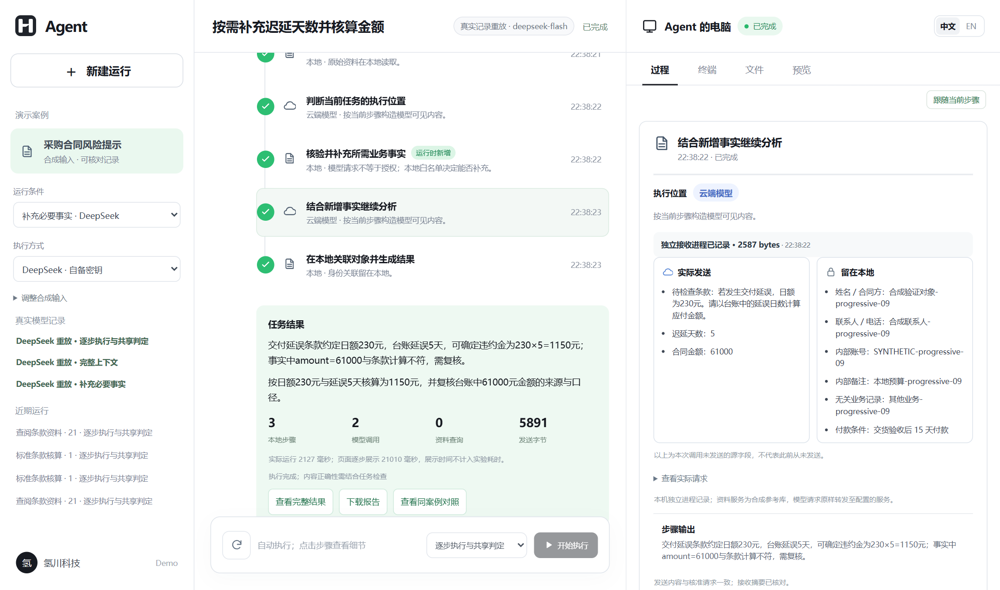
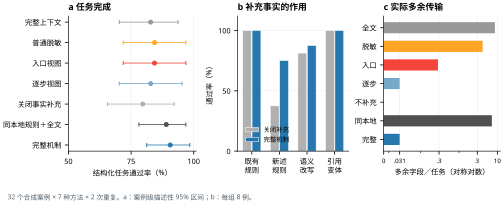

<a id="readme-top"></a>

<div align="center">
  <p>
    <a href="https://github.com/Zane-0260907/stepwise-disclosure-demo/actions/workflows/checks.yml"></a>
    <a href="LICENSE"></a>
    <a href="package.json"></a>
  </p>
  
  <h1>逐步共享判定</h1>
  <p>在智能体运行中，决定每一步在哪里执行，以及当前接收方可以获得哪些事实。</p>
  <p>
    <a href="#快速开始"><strong>快速开始 »</strong></a><br>
    <a href="#演示流程">查看演示</a> ·
    <a href="#复核实验">复核结果</a> ·
    <a href="https://github.com/Zane-0260907/stepwise-disclosure-demo/issues">报告问题</a> ·
    <a href="README.md">English</a>
  </p>
</div>

<details>
  <summary><strong>目录</strong></summary>

  - [项目概述](#项目概述)
    - [技术栈](#技术栈)
  - [快速开始](#快速开始)
  - [演示流程](#演示流程)
  - [复核实验](#复核实验)
  - [证据与边界](#证据与边界)
  - [仓库结构](#仓库结构)
  - [参与改进](#参与改进)
  - [许可与引用](#许可与引用)
</details>

## 项目概述

智能体读取本地资料或收到工具结果后，可能在运行中发现新的步骤。新步骤需要的执行能力、接收方和输入可能与前一步不同。本原型在每个登记步骤重新判断：本地规则能够完成的操作留在本地；否则为实际接收方构造字段视图，在最终请求发出前复核，并保存接收方实际获得的内容。

<p align="center"></p>
<p align="center"><em>中文界面中的 DeepSeek 真实记录重放。右栏可逐步检查实际发送内容与接收记录。</em></p>

这是使用合成合同与学情记录的独立研究原型，不是商业客户端。离线执行器采用有限规则；保存的 DeepSeek 记录来自真实模型调用，但在页面中作为重放展示。界面明确区分两种模式。

### 技术栈

<p>
  <a href="https://nodejs.org/"></a>
  <a href="https://developer.mozilla.org/docs/Web/JavaScript"></a>
  <a href="https://mozilla.github.io/pdf.js/"></a>
  <a href="https://playwright.dev/"></a>
  <a href="https://matplotlib.org/"></a>
</p>

Node.js 承担步骤规划、接收进程和页面服务；PDF.js 解析合成 PDF。Playwright 检查界面，Python/Matplotlib 从保存的实验记录绘图。当前现场适配器与新一轮实验使用 DeepSeek；原始 Qwen-Plus 批次按原版本保留。

<p align="right"><a href="#readme-top">返回顶部 ↑</a></p>

## 快速开始

**环境要求：**[Node.js 24](https://nodejs.org/)。离线演示和真实记录重放都不需要模型密钥。

```sh
git clone https://github.com/Zane-0260907/stepwise-disclosure-demo.git
cd stepwise-disclosure-demo
npm ci
npm start
```

打开 **http://127.0.0.1:4793/**。服务默认只监听本机。目前完成验收的是 Windows；Docker 与 Linux 入口可供尝试，尚未完成接受性验证。

若要重新发起 DeepSeek 现场调用，请在本地设置 `DEEPSEEK_API_KEY` 后重启。适配器使用 `deepseek-flash` 非思考模式。不要把密钥提交到仓库，也不要把带密钥的实例直接暴露到公网；本演示没有多用户鉴权。

<p align="right"><a href="#readme-top">返回顶部 ↑</a></p>

## 演示流程

先选择**本机规则执行器**，再比较以下合成案例：

| 案例 | 应检查的内容 |
| :-- | :-- |
| 标准条款 | 解析 PDF，本地规则完成步骤，不发送模型分析请求。 |
| 引用条款 | 运行中新增资料查询；经核验的视图到达独立本机 HTTP 接收进程，下一步使用返回的指定版本资料。 |
| 发送前撤权 | 在暂停点撤销授权，待发请求被阻断；允许后的另一轮运行产生可对照的接收记录。 |

点击中栏步骤，可检查接收方、实际发送事实、本地保留事实、请求摘要与结果。离线执行器每次重新解析 PDF、执行规则并保存新记录，但不能证明语言模型理解能力。左栏 **DeepSeek 重放**无需密钥，不会重新请求供应商。建议先选择“补充必要事实”：查看初始输入不足、模型提出申请、本地核准、再次分析的完整过程。详见[演示指引](docs/demo-walkthrough.zh-CN.md)。页面放慢的展示节奏不计入实验耗时。

<p align="right"><a href="#readme-top">返回顶部 ↑</a></p>

## 复核实验

当前实验为 **32 个合成案例 × 7 种方法 × 每例 2 次，共 448 次任务运行**，模型为 `deepseek-flash`。其中 560 次实际供应商调用均有匹配的接收记录与出站记录；所有计划任务和失败均保留。输入由作者在原有两个领域中编写，不是外部基准。

| 方法 | 结构化任务通过率 | 多余字段/任务 | 模型调用数 |
| :-- | --: | --: | --: |
| 完整上下文 | 53/64 · 82.8% | 8.625 | 80 |
| 普通脱敏 | 54/64 · 84.4% | 4.125 | 80 |
| 入口视图 | 54/64 · 84.4% | 0.281 | 96 |
| 逐步视图、固定执行域 | 53/64 · 82.8% | 0.031 | 96 |
| 关闭事实补充 | 51/64 · 79.7% | 0 | 64 |
| 同本地规则＋完整上下文 | 57/64 · 89.1% | 7.188 | 64 |
| 完整机制 | **58/64 · 90.6%** | **0.031** | 80 |

<p align="center"></p>

与关闭事实补充相比，完整机制提高 **10.94 个百分点**，案例配对描述性 95% bootstrap 区间为 **1.56 至 23.44**，同时增加 16 次模型调用。与使用相同本地规则的完整上下文对照相比，仅高 **1.56 个百分点**，区间为 **−10.94 至 14.06**，不能据此声称任务质量更优或等效。完整机制仍多发送了两次不必要字段；“获准发送”不等于“完成任务必需”。

无需密钥和新增模型调用，即可重新评分全部 448 次任务：

```sh
npm test
node scripts/verify-progressive-showcase.mjs
python -m zipfile -e evidence/validation-v3/reproduction-records.zip .
npm run verify:v3
```

解压内容进入被 Git 忽略的 `data/research/validation/`。[v3 冻结协议](evidence/validation-v3/protocol.json)在调用前记录源码、输入、标签和对照定义；[完整结果、失败与逐案例汇总](evidence/validation-v3/)均已保存。重绘图表：安装 `requirements-plots.txt` 后运行 `python scripts/plot-validation.py`。

<details>
<summary><strong>开发过程与此前证据</strong></summary>

- **v1：**60 个案例、五种方法、三次重复，900 次 Qwen-Plus 任务。原代码、输入和[统计结果](evidence/research/results/)保持冻结。
- **v2：**36 个同领域新案例、六种方法、两次重复，432 次 DeepSeek 任务。它暴露了必要输入被遗漏的问题，随后用于开发，**不能再作为 v3 的保留评测集**。[协议与结果](evidence/validation-v2/)。
- **v3：**上述 448 次任务在重新冻结后，使用另行编写的同领域案例评价新机制。三个版本不能合并为一个通过率。

```sh
python -m zipfile -e evidence/research/reproduction-records.zip .
node scripts/verify-recorded-scores.mjs frozen-v1-20260925
python -m zipfile -e evidence/validation-v2/reproduction-records.zip .
npm run verify:v2
npm run test:binding
```

另有确定性请求绑定检查：新检查阻断 52/52 次请求变更，旧检查为 12/52；两者均允许八次合法请求。这验证受控的本地发送路径，不证明对任意攻击的语义隐私。[记录](evidence/request-binding/summary.json)。

</details>

<p align="right"><a href="#readme-top">返回顶部 ↑</a></p>

## 证据与边界

[渐进共享演示](evidence/progressive-showcase/)另保存一次真实调用，不计入批次。该记录保留模型索取逾期天数时同时索取多余合同金额的事实，随后得到 1,150 元结果。[此前的资料查询对照](evidence/research/deepseek-live-20260926/)也单独保留。单条轨迹不能替代批量评价。

- 主指标依据作者定义的结构化标签，不代表专家认可自由文本建议。已准备 24 份隐去方法名称的作者内部评阅材料；**人工评分尚未开展**。
- 七种方法均为本仓库机制对照，未运行外部系统基线。[研究定位](docs/research-position.md)明确说明与 MINIM、ToolMinimize、PlanTwin、SplitAgent 的重合及区别。
- 本地控制器绑定使用的源字段、接收方、授权版本和最终应用请求；独立本机进程与适配器记录实际字节，但不是云厂商独立认证。
- 字段计数不检测语义推断泄漏，白名单字段仍可能多余。任意网络旁路和本地控制器被攻破不在本文保证范围。
- 撤权只能阻断未来发送，不能收回此前披露。页面逐步展示的间隔不计入模型耗时。

<p align="right"><a href="#readme-top">返回顶部 ↑</a></p>

## 仓库结构

| 目录 | 内容 |
| :-- | :-- |
| [`src/research/`](src/research/) | 规划、视图、策略复核、接收进程、模型适配与评价 |
| [`web/`](web/) | 与商业产品分离的双语研究界面 |
| [`fixtures/research/`](fixtures/research/) | 合成 PDF、任务目录、引用资料与独立评价标签 |
| [`evidence/research/`](evidence/research/) | 冻结协议、运行记录、统计、边界测试、真实调用与截图 |
| [`scripts/`](scripts/) | 输入核验、独立复算、汇总与绘图 |

<p align="right"><a href="#readme-top">返回顶部 ↑</a></p>

## 参与改进

欢迎通过 [GitHub Issues](https://github.com/Zane-0260907/stepwise-disclosure-demo/issues) 提交故障与复现问题。修改实现前请阅读 [CONTRIBUTING.md](CONTRIBUTING.md)。冻结结果必须保持可复算；改变实验输入或评价器应另建协议版本。

<p align="right"><a href="#readme-top">返回顶部 ↑</a></p>

## 许可与引用

软件以 [Apache-2.0](LICENSE) 开源。仓库中的标识与产品名称用于识别本研究演示，软件许可不授予商标权。素材来源见 [ASSETS.md](ASSETS.md)，软件引用信息见 [CITATION.cff](CITATION.cff)。论文形成稳定出版记录后再补论文引用。

<p align="right"><a href="#readme-top">返回顶部 ↑</a></p>
