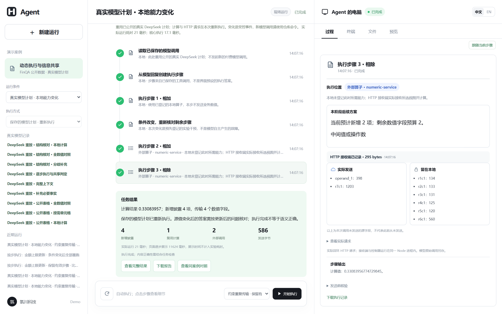
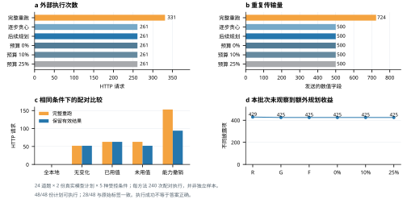
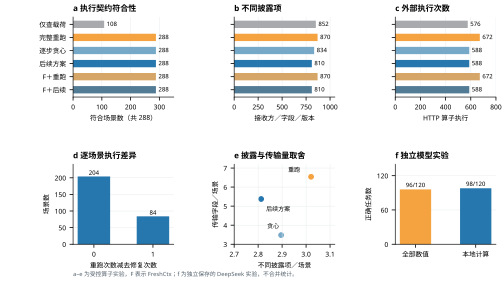
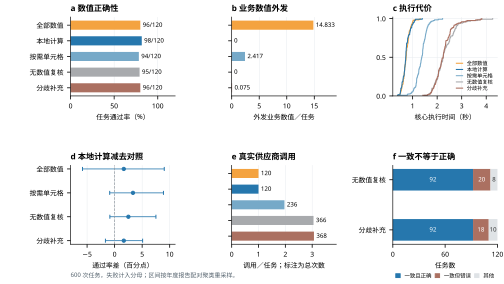

<a id="readme-top"></a>

<div align="center">
  <p>
    <a href="https://github.com/Zane-0260907/stepwise-disclosure-demo/actions/workflows/checks.yml"></a>
    <a href="LICENSE"></a>
    <a href="package.json"></a>
  </p>
  
  <h1>逐步共享判定</h1>
  <p>在智能体运行中，决定每一步在哪里执行，以及当前接收方可以获得哪些事实。</p>
  <p>
    <a href="#快速开始"><strong>快速开始 »</strong></a><br>
    <a href="#演示流程">查看演示</a> ·
    <a href="#复核实验">复核结果</a> ·
    <a href="https://github.com/Zane-0260907/stepwise-disclosure-demo/issues">报告问题</a> ·
    <a href="README.md">English</a>
  </p>
</div>

<details>
  <summary><strong>目录</strong></summary>

  - [项目概述](#项目概述)
    - [技术栈](#技术栈)
  - [快速开始](#快速开始)
  - [演示流程](#演示流程)
  - [复核实验](#复核实验)
  - [证据与边界](#证据与边界)
  - [仓库结构](#仓库结构)
  - [参与改进](#参与改进)
  - [许可与引用](#许可与引用)
</details>

## 项目概述

智能体读取本地资料或收到工具结果后，可能在运行中发现新的步骤。新步骤需要的执行能力、接收方和输入可能与前一步不同。本原型在每个登记步骤重新判断：本地规则能够完成的操作留在本地；否则为实际接收方构造字段视图，在最终请求发出前复核，并保存接收方实际获得的内容。

<p align="center"></p>
<p align="center"><em>中文界面的真实 HTTP 修复运行。右栏可逐步检查条件变化、实际发送内容与接收记录。</em></p>

这是使用合成合同、学情记录及公开 FinQA 表格子集的独立研究原型，不是商业客户端。离线执行器采用有限规则；保存的 DeepSeek 记录来自真实模型调用，在页面中作为重放展示。新增数值路径由模型根据表结构提出有限表达式，再由本地解释器读取依赖的数值并计算。

### 技术栈

<p>
  <a href="https://nodejs.org/"></a>
  <a href="https://developer.mozilla.org/docs/Web/JavaScript"></a>
  <a href="https://mozilla.github.io/pdf.js/"></a>
  <a href="https://playwright.dev/"></a>
  <a href="https://matplotlib.org/"></a>
</p>

Node.js 承担步骤规划、接收进程和页面服务；PDF.js 解析合成 PDF。Playwright 检查界面，Python/Matplotlib 从保存的实验记录绘图。当前现场适配器与新一轮实验使用 DeepSeek；原始 Qwen-Plus 批次按原版本保留。

<p align="right"><a href="#readme-top">返回顶部 ↑</a></p>

## 当前版本 真实模型计划与受限后续执行

**中文主稿已更新：**[四页 Word 正文](paper/zh-CN/按步执行与信息共享_中文最新稿.docx) · [PDF 阅读版](paper/zh-CN/按步执行与信息共享_中文最新稿.pdf)。正文已纳入财务实验、多轮原生业务任务和逐轨迹对照，重新说明贡献与适用范围。[正文数字来源](paper/zh-CN/evidence.json)从已核查记录生成；现有可视页面仍展示财务执行，业务适配器保留独立运行入口。

**信息补充执行器：**运行 `node scripts/run-requirement-demo.mjs`，可实际重跑“派生输入—能力变化—重新判定—本地完成”的三阶段案例与两次 HTTP 发送。它是构造的集成检查，未冒充新的真实任务实验。[输入、算法、记录与边界](docs/requirement-controller.md#中文说明)。

> **V10 开发记录：**已接通原始零售与航空多轮任务、会修改状态的业务工具、本地参数绑定和共同确认流程。952 次真实模型调用均可离线核查。这六个训练任务尚未证明新的联合选择算法或相对强基线的增益。[查看完整结果和剩余差距](docs/v10-development-review.zh-CN.md)。

> **机制验证：**固定模型动作与用户确认后，对 12 条轨迹、107 个动作成对重放；移除新增引用检查未改变任何业务执行结果。现有候选未通过核心贡献验证。[逐步证据与已有工作比较](docs/mechanism-gate.zh-CN.md)。

> **早期开发记录：**v9 延迟共享候选未通过初步强基线比较。[查看开发结论及离线复核方法](docs/v9-development-review.zh-CN.md)。202 次主开发调用的原始记录已保存，不作为新的论文改进结论。

核心仍是**每一步在哪里执行、向当前接收方发送什么**。v8 把真实模型工具调用、计算图、源值与能力变化、有效结果复用和接收记录接在同一条链路中。后续规划加入共用的阶段传输预算，默认不超过同阶段贪心方案的数值字段次数。

**建议从这里开始：**选择“真实模型计划 · 本地能力变化”，运行“约束重复传输 · 保留有效结果”，再与“条件变化后全部重跑”比较。无密钥模式重用已公开的真实模型计划，但本轮重新执行计算和 HTTP 请求。新模型调用使用自备密钥的批次命令。[详细中文操作与复现](docs/reproduction-v8.zh-CN.md)。

## 快速开始

**环境要求：**[Node.js 24](https://nodejs.org/)。离线演示和真实记录重放都不需要模型密钥。

```sh
git clone https://github.com/Zane-0260907/stepwise-disclosure-demo.git
cd stepwise-disclosure-demo
npm ci
npm start
```

打开 **http://127.0.0.1:4793/**，保留启动终端。服务默认只监听本机。自动复算检查覆盖 Windows 和 Ubuntu；交互浏览器验收在 Windows 完成。Docker 配置已提供，但未单独完成部署验收。

若要重新发起 DeepSeek 现场调用，请在本地设置 `DEEPSEEK_API_KEY` 后重启。适配器使用 `deepseek-flash` 非思考模式。不要把密钥提交到仓库，也不要把带密钥的实例直接暴露到公网；本演示没有多用户鉴权。

### 第一次应该选择什么

| 方式 | 是否需要密钥 | 实际发生的事情 |
|:--|:--:|:--|
| 本机规则执行器 | 否 | 重新读取合成输入、执行有限规则、生成新记录 |
| 真实模型记录重放 | 否 | 按原有事件顺序展示已经保存的真实请求和回复 |
| DeepSeek 现场运行 | 自备 | 重新请求模型，产生新的步骤、接收记录和结果 |
| 批量实验复核 | 否 | 从公开原始记录重新评分，不请求模型 |

先选择**真实模型计划 · 本地能力变化**，点击开始执行。步骤会自动推进；点击某一步查看右栏中的实际输入和接收记录，点击**跟随当前步骤**恢复自动跟随。**文件**和**预览**显示源材料与结果；执行结束后可下载报告和原始记录。页面放慢展示，不把展示时间算成实验耗时。

### 配置自己的 DeepSeek 现场调用

Windows PowerShell，在仓库根目录执行：

```powershell
./scripts/start-demo.ps1 -UseDeepSeek
```

脚本会以隐藏输入方式询问密钥。先停止已运行的服务终端再重启。密钥只保存在本机进程环境中，不写入源码、网页脚本或公开记录。

Linux / Bash：

```bash
read -rsp 'DeepSeek API key: ' DEEPSEEK_API_KEY; echo
export DEEPSEEK_API_KEY
npm start
# 停止服务后清除变量：
unset DEEPSEEK_API_KEY
```

在页面选择 **DeepSeek · 自备密钥**。若 4793 被占用，启动前设置 `DEMO_PORT=4794`，再访问对应端口。离线演示不需要 Python；下方的 ZIP 解包复算需要 Python 3.10 以上。

<p align="right"><a href="#readme-top">返回顶部 ↑</a></p>

## 演示流程

先选择**本机规则执行器**，再比较以下合成案例：

| 案例 | 应检查的内容 |
| :-- | :-- |
| 标准条款 | 解析 PDF，本地规则完成步骤，不发送模型分析请求。 |
| 引用条款 | 运行中新增资料查询；经核验的视图到达独立本机 HTTP 接收进程，下一步使用返回的指定版本资料。 |
| 发送前撤权 | 在暂停点撤销授权，待发请求被阻断；允许后的另一轮运行产生可对照的接收记录。 |

点击中栏步骤，可检查接收方、实际发送事实、本地保留事实、请求摘要与结果。离线执行器每次重新解析 PDF、执行规则并保存新记录，但不能证明语言模型理解能力。左栏 **DeepSeek 重放**无需密钥，不会重新请求供应商。建议先选择“补充必要事实”：查看初始输入不足、模型提出申请、本地核准、再次分析的完整过程。详见[演示指引](docs/demo-walkthrough.zh-CN.md)。页面放慢的展示节奏不计入实验耗时。

<p align="right"><a href="#readme-top">返回顶部 ↑</a></p>

## 复核实验

### v8：真实模型计划与执行闭环

**24 道公开问题 · 48 份模型计划 · 96 次真实调用 · 1,440 次配对执行。** 每份模型计划共享给五种条件和六个方法，不将其重复计算为独立模型调用。

| 结果 | 完整重跑 | 贪心修复 | 后续规划 | 预算 0% |
|:--|--:|--:|--:|--:|
| 实际 HTTP 算子调用 | 331 | 261 | 261 | 261 |
| 发送数值字段 | 724 | 500 | 500 | 500 |
| 不同披露项 | 429 | 425 | 425 | 425 |
| 程序执行一致 / 240 | 240 | 240 | 240 | 240 |
| 参考表达式一致 / 240 | 137 | 137 | 137 | 137 |

原始问题标签一致性为 **28/48**，不是人审正确率；两道标签程序疑似与题意冲突，原评分保留。局部修复节省 21.1% 外部调用，**后续规划和三档预算在本批次没有额外收益**。全部失败和无收益结果均公开。

<p align="center"></p>

```powershell
Expand-Archive -LiteralPath evidence/validation-v8/reproduction-records.zip -DestinationPath . -Force
npm run verify:v8
```

[完整教程](docs/reproduction-v8.zh-CN.md)包括首次操作、无密钥核验、自备密钥新实验、预算定义、全部错误与指标边界。下面旧实验分别保留，不与 v8 合并。

### v7：动态修复与实际外部检查组件

**288 个受控场景 · 六种方法 · 1,728 次执行 · 3,684 条 HTTP 接收记录。** FreshCtx 0.16.0 实际执行 576 次边界检查，恢复策略由我们的封装提供。

| 方法 | 契约符合 / 288 | 不同披露项 | HTTP 执行 | 传输字段 |
|:--|--:|--:|--:|--:|
| 仅查载荷消融 | 108 | 852 | 576 | 966 |
| 完整重跑 | 288 | 870 | 672 | 1,884 |
| 逐步贪心修复 | 288 | 834 | 588 | 1,002 |
| 后续规划修复 | 288 | 810 | 588 | 1,548 |
| FreshCtx＋重跑 | 288 | 870 | 672 | 1,884 |
| FreshCtx＋后续修复 | 288 | 810 | 588 | 1,548 |

**288 个符合＝264 个完成＋24 个正确阻止。** 局部修复相对完整重跑减少 12.5% 外部执行；后续规划相对逐步贪心少披露 2.9% 的不同信息项，但传输字段增加 54.5%。这些是受控参数组合，不是独立真实任务；披露计数不代表语义隐私保证。

<p align="center"></p>

```sh
python -m zipfile -e evidence/validation-v7/reproduction-records.zip .
npm run verify:v7
```

核验保存记录无须密钥或安装 FreshCtx。重新执行实验的固定依赖、完整命令、预期输出、逐场景记录与故障处理见 [v7 完整中文教程](docs/reproduction-v7.zh-CN.md)。

### v6：单独保留的真实模型实验

**独立 v6：600 次任务 · 1,210 次真实 DeepSeek 调用 · 60 个公开页面、57 份公司年度报告。** 测试前冻结协议，错误答案与异常全部保留。

| 方法 | 正确／计划任务 | 业务数值外发／任务 | 模型调用 |
|:--|--:|--:|--:|
| 全部数值，单次规划 | 96/120 | 14.833 | 120 |
| 表结构规划，本地计算 | 98/120 | 0 | 120 |
| 按需单元格 | 94/120 | 2.417 | 236 |
| 三方案＋无数值复核 | 95/120 | 0 | 366 |
| 三方案＋分歧补充 | 96/120 | 0.075 | 368 |

单次本地计算不发送业务数值，但问题、表结构、年份与单位仍可见。相对全量数值的准确率差为 **+1.67 个百分点，描述性区间 −5.83 至 +9.02**，不足以证明更优或不劣。分歧补充增加调用，尚无可靠效用优势，因此保留为实验选项。

<p align="center"></p>

### 无密钥复算

在仓库根目录执行；Python 仅用标准库解压，不请求模型。

```sh
npm test
python -m zipfile -e evidence/validation-v6/reproduction-records.zip .
npm run verify:v6
node scripts/verify-corrected-showcase.mjs
```

预期为 **600 个任务、1,210 条供应商请求、1,310 次程序复核**。验证器从原始表格重建字段角色，核验冻结摘要，重新执行算式与评分，并逐条匹配请求和响应。另有三次开发示例、五次真实调用，单独核验，不计入实验样本。

### 自备密钥重新实验

按上方教程安全设置本地 `DEEPSEEK_API_KEY` 后执行：

```sh
npm run experiment:v6 -- --run-id=my-v6-01
node scripts/verify-v6.mjs --run-id=my-v6-01
```

同名任务只恢复尚未执行的作业；失败不自动重跑。新记录与复算输出保存在忽略目录 `data/research/validation/<run-id>/`，不覆盖发表记录。重新调用模型不保证得到逐字相同的输出。

### 从真实数据重绘

```sh
pip install -r requirements-plots.txt
python scripts/plot-v6.py --lang zh
python scripts/plot-v6.py --lang en
```

[完整中文复现教程](docs/reproduction-v6.zh-CN.md)说明安装、演示步骤、密钥、筛选规则、方法定义、统计区间与故障处理。[最新协议和全部结果](evidence/validation-v6/)包含失败样本；[机制说明](docs/conflict-view.md)给出句法最小覆盖的定义与边界。

<details>
<summary><strong>旧实验与表格转换更正</strong></summary>

- v4 保留 256 次合成强对照及 240 次旧表格任务：[结果](evidence/validation-v4/)／[教程](docs/reproduction-v4.md)。
- v5 保留 600 次表格任务、1,579 次真实调用：[记录](evidence/validation-v5/)。多方案一致性未解决原有损失。
- 旧转换器曾将部分年份表头作为业务数值隐藏，破坏列含义；不能把旧差值解释成数值隐藏必然造成的效用损失。v6 修复结构，对所有方法统一应用，并排除先前报告。[更正说明](docs/table-adapter-correction.md)。这项修复不被包装成算法创新。
- [v1](evidence/research/)、[v2](evidence/validation-v2/)、[v3](evidence/validation-v3/)的历史记录、协议和原始结果均保留，不合并为新的独立样本。

```sh
python -m zipfile -e evidence/validation-v5/reproduction-records.zip .
npm run verify:v5
```

</details>

<p align="right"><a href="#readme-top">返回顶部 ↑</a></p>

## 证据与边界

[最新中文 Word](paper/zh-CN/按步执行与信息共享_中文最新稿.docx)已同时报告财务模型图实验、原生业务开发任务与固定轨迹对照，构造检查另外注明；[PDF 阅读版](paper/zh-CN/按步执行与信息共享_中文最新稿.pdf)和[公式及算法源码](paper/zh-CN/公式与算法源码.md)同步提供。这是中文编辑稿，尚非正式英文 ACM 提交稿。

[渐进共享演示](evidence/progressive-showcase/)另保存一次真实调用，不计入批次。该记录保留模型索取逾期天数时同时索取多余合同金额的事实，随后得到 1,150 元结果。[此前的资料查询对照](evidence/research/deepseek-live-20260926/)也单独保留。单条轨迹不能替代批量评价。

- 主指标依据作者定义的结构化标签，不代表专家认可自由文本建议。已准备 24 份隐去方法名称的作者内部评阅材料；**人工评分尚未开展**。
- v7 已实际接入 FreshCtx 0.16.0，并使用相同依赖比较我们的两种恢复封装；尚未复现其他完整智能体系统的端到端对照。[研究定位](docs/research-position.md)明确说明与 MINIM、ToolMinimize、PlanTwin、SplitAgent 的重合及区别。
- 本地控制器绑定使用的源字段、接收方、授权版本和最终应用请求；独立本机进程与适配器记录实际字节，但不是云厂商独立认证。
- 字段计数不检测语义推断泄漏，白名单字段仍可能多余。任意网络旁路和本地控制器被攻破不在本文保证范围。
- 撤权只能阻断未来发送，不能收回此前披露。页面逐步展示的间隔不计入模型耗时。

<p align="right"><a href="#readme-top">返回顶部 ↑</a></p>

## 仓库结构

| 目录 | 内容 |
| :-- | :-- |
| [`src/research/`](src/research/) | 规划、视图、策略复核、接收进程、模型适配与评价 |
| [`web/`](web/) | 与商业产品分离的双语研究界面 |
| [`fixtures/research/`](fixtures/research/) | 合成 PDF、任务目录、引用资料与独立评价标签 |
| [`fixtures/finqa-v6/`](fixtures/finqa-v6/) | 公开表格受限子集、原始数值标签、选择规则与数据许可 |
| [`evidence/validation-v7/`](evidence/validation-v7/) | 保留的受控修复实验协议、全部原始记录、分层结果和双语图表 |
| [`evidence/validation-v6/`](evidence/validation-v6/) | 单独保留的真实模型调用及数值评价 |
| [`evidence/corrected-showcase/`](evidence/corrected-showcase/) | 同一公开表格三种方法的真实记录与双语截图 |
| [`evidence/research/`](evidence/research/) | 冻结协议、运行记录、统计、边界测试、真实调用与截图 |
| [`scripts/`](scripts/) | 输入核验、独立复算、汇总与绘图 |
| [`paper/zh-CN/`](paper/zh-CN/) | 最新中文 Word、四页 PDF、原生公式与构建源文件 |

<p align="right"><a href="#readme-top">返回顶部 ↑</a></p>

## 参与改进

欢迎通过 [GitHub Issues](https://github.com/Zane-0260907/stepwise-disclosure-demo/issues) 提交故障与复现问题。修改实现前请阅读 [CONTRIBUTING.md](CONTRIBUTING.md)。冻结结果必须保持可复算；改变实验输入或评价器应另建协议版本。

<p align="right"><a href="#readme-top">返回顶部 ↑</a></p>

## 许可与引用

软件以 [Apache-2.0](LICENSE) 开源。仓库中的标识与产品名称用于识别本研究演示，软件许可不授予商标权。素材来源见 [ASSETS.md](ASSETS.md)，软件引用信息见 [CITATION.cff](CITATION.cff)。论文形成稳定出版记录后再补论文引用。

<p align="right"><a href="#readme-top">返回顶部 ↑</a></p>
